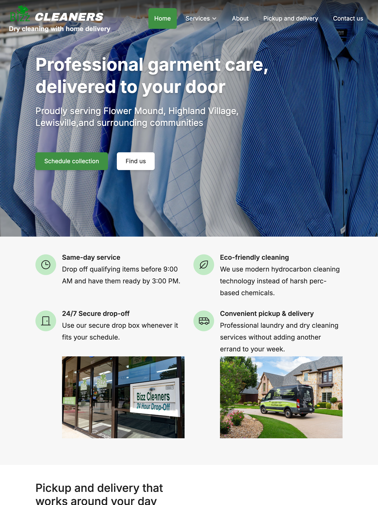
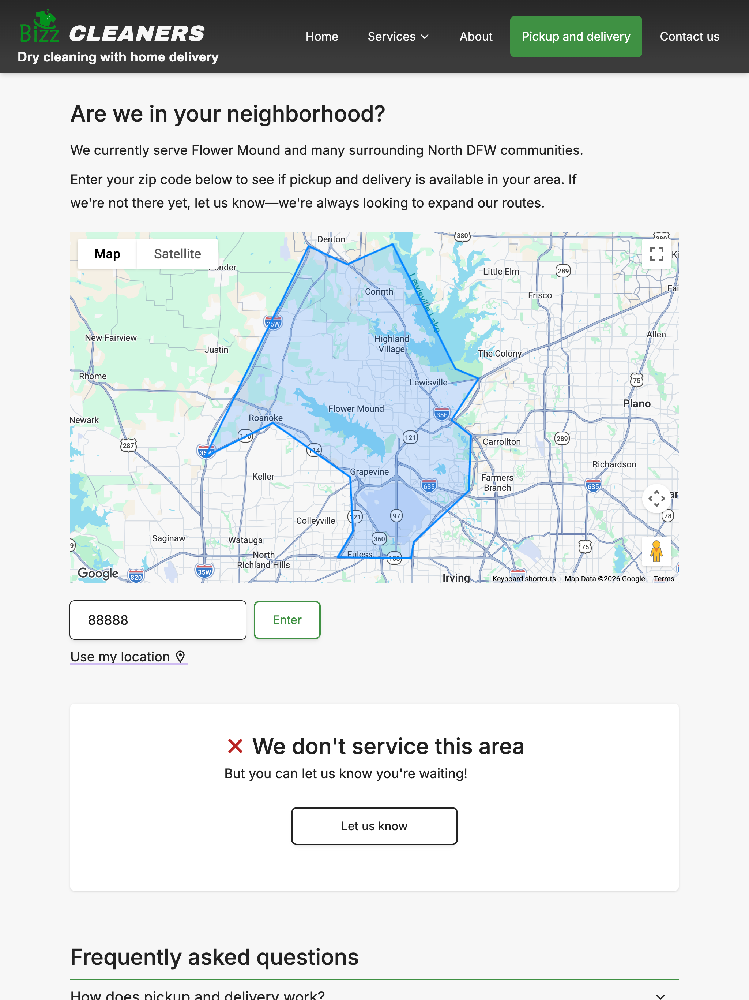
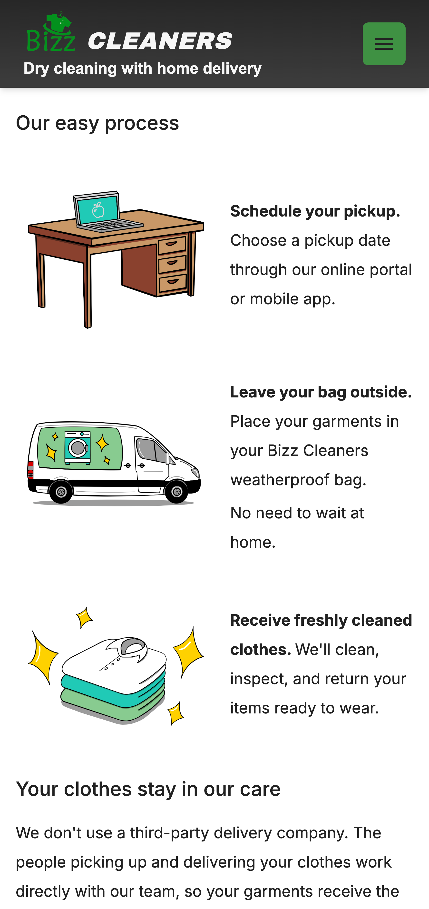
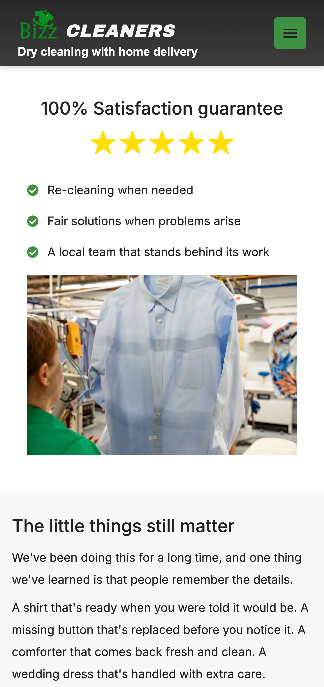

# Bizz Cleaners Website

Full stack website for a dry cleaners, to help them attract customers.
 
<b>[Link to website](https://www.bizzclean.com/)</b>

## Features
- Showcases the best of Bizz Cleaners work through professional photography and copy
- Gives users a way to access the online portal
- Displays business hours and rating information directly from Google business profile
- Lets user validate zip code before choosing to sign up

## Impact
- Replaced old template website solo over 6 months
- Decreased 10s bounce rate from 35% to 7.5% (GA4)
- Increased CTR from 1.5% to 3.2%
- Fixed over 10 usability issues through testing and review

## Tech
React · TypeScript · Tailwind CSS · Express.js · REST API

## Process
User testing · Design system · Usability heuristics

## Demo
### Home page

### Zip code validator

  
### Explanation of Delivery Process 

### Satisfaction guarantee 

